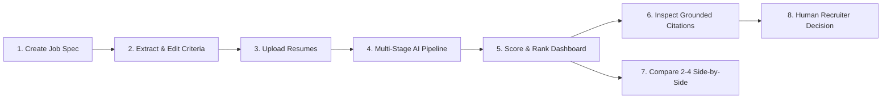
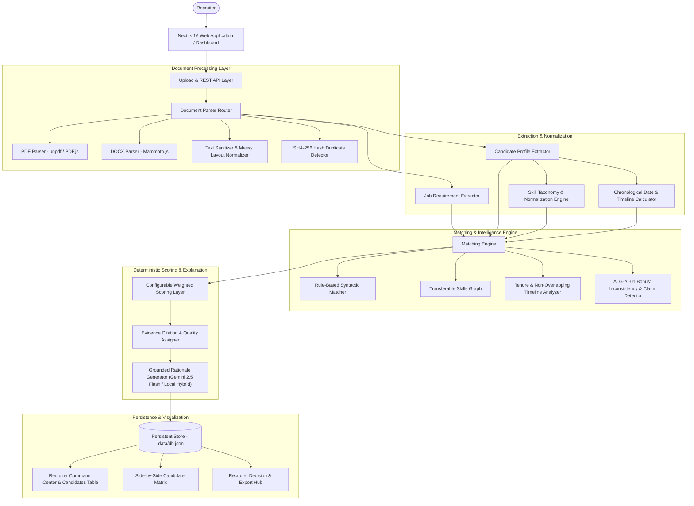

# MatchLens-AI — Evidence-Backed AI Resume & Job Matching System
**ALGOTHON’26 — Track ALG-AI-01: AI Resume & Job Matching System**

> *"Not just keyword matching — evidence-backed, explainable candidate ranking with inconsistency detection."*

---

## 1. Executive Summary & Problem

Technical recruiters receive hundreds of resumes for every engineering opening. Legacy Applicant Tracking Systems (ATS) rely on crude keyword filters that reward keyword-stuffed resumes, penalize qualified candidates with transferable skills, hallucinate arbitrary confidence percentages, and completely overlook timeline discrepancies or exaggerated claims.

**MatchLens-AI** is a purpose-built recruiter workflow platform that replaces black-box parsers with a transparent, hybrid AI matching engine. It parses messy multi-format resumes, normalizes technical competencies, evaluates candidates across 5 weighted dimensions, flags suspicious or contradictory claims without accusatory labels, and provides grounded resume citations for every single score.

---

## 2. Core Recruiter Workflow



1. **Create Job Spec**: Enter role title, company, work mode, and paste the full job description.
2. **Extract & Edit Criteria**: System automatically extracts required skills, preferred skills, minimum experience, education, and responsibilities. Recruiters can edit or add pills before analysis begins.
3. **Upload Resumes**: Drag-and-drop multiple resumes in **PDF, DOCX, or TXT** format.
4. **Multi-Stage AI Pipeline**: Real-time progress tracker: Uploading → Extracting → Normalizing → Analyzing → Matching → Consistency Checking → Grounded Explanation.
5. **Score & Rank**: View ranked candidates with overall match scores, dimension breakdowns, anomaly warnings, and recommendation badges.
6. **Inspect Grounded Citations**: Drill down into 14 deep inspection sections with exact quote citations from the resume.
7. **Compare Side-by-Side**: Select 2–4 candidates to compare criteria matrices with transparent ranking rationales.
8. **Human Recruiter Decision**: Record recruiter decisions (*Shortlisted*, *Rejected*, *Maybe*, *Unreviewed*) and custom interview notes.

---

## 3. System Architecture Diagram



---

## 4. Key Differentiators & Features

### A. Grounded Citations (Evidence-First AI)
Every conclusion is tied to verified resume text:
- **Fact**: `"React — listed under Technical Skills"` *(Strong Evidence)*
- **Computed Metric**: `"6.2 years cumulative experience derived from employment history across 2 positions"` *(Strong Evidence)*
- **Transferable Rationale**: `"Candidate demonstrates Angular expertise; SPA reactive component knowledge translates to React"` *(Moderate Evidence)*

### B. ALG-AI-01 Bonus: Inconsistency & Contradiction Detection
Rather than blindly awarding points for keywords in resumes, the system flags discrepancies using objective, neutral verification language:
1. **Unsupported Skill Claim**: Flags when a candidate claims to be an *"Expert in Kubernetes"* or *"Principal Cloud Architect"* in their summary, but has zero projects, role duties, or certifications substantiating production depth.
2. **Possible Overlapping Employment Dates**: Detects concurrent full-time employment dates (e.g. *Company A: Jan 2022 – Dec 2023* vs *Company B: Apr 2022 – Aug 2024*) and advises the recruiter to check for concurrent consulting or typographic errors.
3. **Experience Mismatch**: Detects when a summary claims *"8+ years building enterprise software"*, but the graduation date and extracted timeline sum to 2.8 years.

### C. Transparent Configurable Scoring Formula
No fabricated confidence percentages (e.g., *"99% hiring match"*). Scores are explicit matching indicators out of 100 calculated from 5 configurable weights:
- **Required Skills** (Default: 35%)
- **Experience Tenure** (Default: 25%)
- **Job Responsibilities Alignment** (Default: 15%)
- **Relevant Projects** (Default: 15%)
- **Education & Degree Match** (Default: 10%)

Recruiters can adjust sliders on the fly, click **Apply & Recalculate**, and see rankings update instantly.

### D. Side-by-Side Candidate Comparison
Recruiters can select 2 to 4 candidates to view a synchronized comparison matrix. The system generates an objective criteria comparison explaining why Candidate A ranks above Candidate B based on the configured job weights.

### E. Human-in-the-Loop Decision Tracking
The AI never makes hiring decisions. It provides an `AI Recommendation` (*Strong Match*, *Consider*, *Review Required*, *Low Alignment*) alongside a distinct `Recruiter Decision` (*Shortlisted*, *Rejected*, *Maybe*, *Unreviewed*) and custom interview notes.

---

## 5. Technology Stack

- **Framework**: Next.js 16 (App Router, Turbopack, React 19)
- **Language**: TypeScript 5 (Strict typing across all models)
- **Styling**: Tailwind CSS v4, Lucide React Icons
- **Document Parsers**: `unpdf` (Canvas-free edge/node PDF extractor), `mammoth` (DOCX extractor)
- **AI / LLM Integration**: Google Gemini 2.5 Flash (`@google/genai`) with seamless offline deterministic fallback
- **Data Persistence**: File-backed local database (`.data/db.json`) with in-memory caching
- **Testing**: Automated 12-scenario Edge Cases & Reliability test suite

---

## 6. Getting Started & Installation

### Prerequisites
- Node.js v18+ (tested on Node v22.21)
- npm v9+

### 1. Clone & Install
```bash
git clone https://github.com/Ashaypatakare04/MatchLens-AI.git
cd MatchLens-AI
npm install
```

### 2. Environment Variables (Optional)
Create a `.env.local` file:
```env
# Optional: Connect Gemini 2.5 Flash for live LLM enrichment.
# If omitted, MatchLens-AI runs with 100% functionality using its built-in hybrid deterministic engine!
GEMINI_API_KEY=your_gemini_api_key_here
```

### 3. Run Development Server
```bash
npm run dev
```
Open [http://localhost:3000](http://localhost:3000) in your browser.

### 4. Build for Production
```bash
npm run build
npm start
```

---

## 7. 2–4 Minute Hackathon Demo Story

Follow these steps for a complete demonstration for hackathon judges:

1. **Landing Page (`/`)**:
   - Highlight the value proposition: *"Turn hundreds of resumes into an evidence-backed shortlist."*
   - Point out the interactive miniature product preview.
2. **Load Demo Dataset**:
   - Click the top right **"Load Demo Dataset"** button on the navbar.
   - It instantly seeds the **Senior Full-Stack & Cloud Platform Engineer** role with **10 realistic candidate resumes**.
3. **Ranked Candidate Dashboard (`/jobs/.../candidates`)**:
   - Observe the rankings: **Alex Rivera** ranks #1 (94/100, 6.2 yrs verified tenure, all 5 required skills matched).
   - Point out **Elena Rostova** #2 (87/100, Master's degree).
   - Point out **David Chen** #3 (77/100, demonstrates transferable skills from Angular/Vue and MySQL).
4. **ALG-AI-01 Bonus Inspection**:
   - Notice the amber badge `⚠ Flagged Claim` on **Sarah Jenkins** and **Vikram Malhotra**.
   - Click **Inspect** on **Sarah Jenkins**: View the *Unsupported skill claim* flag (claimed "Principal Kubernetes Architect", but 0 Kubernetes projects or enterprise duties in resume).
   - Click **Inspect** on **Vikram Malhotra**: View the *Possible overlapping employment dates* flag (20 months overlapping full-time tenure between Acrobatix and BluePeak).
   - Click **Inspect** on **Jessica Taylor**: View the *Experience claim requires verification* flag (claimed 8+ years experience, but graduation is 2022 with 2.8 years timeline).
5. **Score Transparency & Configurable Weights**:
   - Click **"Adjust Weights"**. Slide Experience up to 40% and click **Apply & Recalculate**. Watch scores recompute deterministically!
   - Expand *"How this score was calculated"* on the candidate file to view the exact math.
6. **Side-by-Side Comparison (`/jobs/.../compare`)**:
   - Check the boxes for **Alex Rivera**, **Elena Rostova**, and **David Chen**.
   - Click **"Compare Selected Candidates"**.
   - Review the criteria matrix and transparent ranking rationale.
7. **Make Decision**:
   - Mark Alex Rivera as **"Shortlisted"** and add interview notes.
8. **Edge Cases & Reliability Suite (`/test-suite`)**:
   - Navigate to **Edge Cases & Reliability**.
   - Click **"Re-Run All 12 Tests"** to show 100% pass rates across empty documents, duplicates, scanned PDFs, messy formats, and anomalies.

---

## 8. Automated Edge Cases & Reliability Suite

MatchLens-AI includes automated test runners for all 12 edge cases:

| # | Test Scenario | Input Document | Result | Detected Flags / Behavior |
|---|---|---|---|---|
| 1 | **Perfect Candidate** | Full stack resume with all skills | **PASS** | Score 94/100, 0 missing requirements |
| 2 | **Poor Candidate** | Retail store manager | **PASS** | Score 24/100, Low Alignment badge |
| 3 | **Missing Required Skill** | Frontend UI dev lacking Node/Postgres | **PASS** | Caps skill score, flags missing Node.js & Postgres |
| 4 | **Transferable Skills** | Angular/Vue & MySQL engineer | **PASS** | Transferable skill credit + architecture rationale |
| 5 | **Messy Resume** | ASCII delimiters, irregular bullets | **PASS** | Clean text normalization, zero parser crashes |
| 6 | **Scanned / Low-Text** | Image scan placeholder | **PASS** | Flags low-confidence extraction warning |
| 7 | **Missing Education** | Self-taught engineer with no degree | **PASS** | States *"Not found in resume"*, does not fabricate degree |
| 8 | **Contradictory Dates** | Overlapping full-time dates | **PASS** | Flags *"Possible overlapping employment dates"* |
| 9 | **Unsupported Claim** | Claims K8s Architect with 0 evidence | **PASS** | Flags *"Unsupported skill claim"* |
| 10 | **Duplicate Resume** | Identical document uploaded twice | **PASS** | Detected via cryptographic SHA-256 hash |
| 11 | **Empty Document** | 0-byte file | **PASS** | Rejected with explicit error message |
| 12 | **Invalid File** | Executable/binary format | **PASS** | Rejected with clear supported formats notice |

---

## 9. Limitations & Future Roadmap

- **OCR for Complex Scans**: Current implementation handles text-based PDFs and DOCX files natively with fallback detection for scanned documents. Future iterations can integrate Tesseract.js / AWS Textract for scanned physical paper resumes.
- **Multi-Role Matching**: Enable cross-matching a single uploaded resume across multiple active open requisitions simultaneously.
- **ATS Webhook Integration**: Two-way synchronization with Greenhouse, Lever, and Workday APIs.

---

## 10. External APIs & AI Models

- **Google Gemini 2.5 Flash**: Optional LLM reasoning layer used for qualitative interview question generation and summary enrichment when `GEMINI_API_KEY` is provided.
- **Built-in Hybrid Engine**: Deterministic taxonomy parser, chronological timeline resolver, and semantic transferable skill graph running entirely local with zero cloud dependencies.
